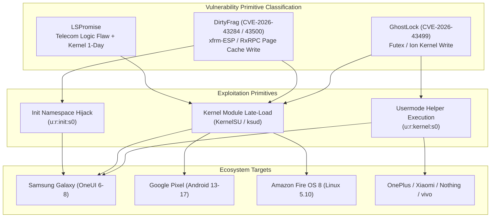

# Speed Lock — Research Status & Vulnerability Analysis

**Archive Baseline Date:** 2026-10-09  
**Status:** Archive Established, Synchronized, Audited, and Expanded with 5.10 Research  
**Total Monitored Projects:** 39  

---

## 1. Executive Summary

The **Speed Lock** research archive tracks modern Android kernel security research, with a concentrated focus on breakthrough vulnerability classes that revolutionized local privilege escalation (LPE), locked-bootloader rooting, and late-stage runtime injection across the Android ecosystem:

1. **IonStack / GhostLock (CVE-2026-43499)** — A kernel memory manipulation vulnerability originating in the Android Ion / Futex subsystems, weaponized to achieve arbitrary kernel writes and spawn usermode helper tasks directly in `u:r:kernel:s0`.
2. **DirtyFrag (CVE-2026-43284 & CVE-2026-43500)** — A deterministic page-cache write primitive spanning `xfrm-ESP` and `RxRPC` network subsystems, extending the legendary "Dirty Pipe" and "Copy Fail" vulnerability classes into modern kernels.
3. **Telecom Logic 0-Day + Kernel 1-Day (LSPromise)** — A logic flaw in Android 17 Telecom `InCallController` providing `system_server` execution, paired with kernel 1-day primitives to achieve 100% deterministic KernelSU injection without memory corruption.
4. **Kernel 5.10 & MediaTek Dimensity Research** — Dedicated analysis of Linux 5.10 LTS / Android 5.10 GKI & vendor kernels, with definitive primary stock ROM forensics, deep DFRoot audit, unified Android application project ([`speedlock-app/`](file:///c:/Users/Admin/Videos/Github/Speed%20Lock/speedlock-app/)), and modular integration testbench for the Infinix GT 20 Pro (`X6871`, MediaTek Dimensity 8200 Ultimate `MT6896`). Implementation directory: [`integration/x6871/`](file:///c:/Users/Admin/Videos/Github/Speed%20Lock/integration/x6871/). Detailed reports:
   - [`research/device-compatibility/X6871_UNIFIED_INTEGRATION.md`](file:///c:/Users/Admin/Videos/Github/Speed%20Lock/research/device-compatibility/X6871_UNIFIED_INTEGRATION.md)
   - [`research/device-compatibility/X6871_VALIDATION_RESULTS.md`](file:///c:/Users/Admin/Videos/Github/Speed%20Lock/research/device-compatibility/X6871_VALIDATION_RESULTS.md)
   - [`research/device-compatibility/DFROOT_X6871_AUDIT.md`](file:///c:/Users/Admin/Videos/Github/Speed%20Lock/research/device-compatibility/DFROOT_X6871_AUDIT.md)
   - [`research/device-compatibility/DFROOT_X6871_COMPATIBILITY_MATRIX.md`](file:///c:/Users/Admin/Videos/Github/Speed%20Lock/research/device-compatibility/DFROOT_X6871_COMPATIBILITY_MATRIX.md)
   - [`research/device-compatibility/DFROOT_X6871_SUPPORT_PLAN.md`](file:///c:/Users/Admin/Videos/Github/Speed%20Lock/research/device-compatibility/DFROOT_X6871_SUPPORT_PLAN.md)
   - [`research/firmware/X6871/analysis-reports/STOCK_FIRMWARE_ANALYSIS.md`](file:///c:/Users/Admin/Videos/Github/Speed%20Lock/research/firmware/X6871/analysis-reports/STOCK_FIRMWARE_ANALYSIS.md)
   - [`research/firmware/X6871/analysis-reports/KERNEL_5_10_COMPATIBILITY.md`](file:///c:/Users/Admin/Videos/Github/Speed%20Lock/research/firmware/X6871/analysis-reports/KERNEL_5_10_COMPATIBILITY.md)
   - [`research/device-compatibility/KERNEL_5_10_RESEARCH.md`](file:///c:/Users/Admin/Videos/Github/Speed%20Lock/research/device-compatibility/KERNEL_5_10_RESEARCH.md)
   - [`research/device-compatibility/X6871_KERNEL_RESEARCH.md`](file:///c:/Users/Admin/Videos/Github/Speed%20Lock/research/device-compatibility/X6871_KERNEL_RESEARCH.md)

---

## 2. Comparative Vulnerability Analysis

### Detailed Vector Comparison

| Characteristic | GhostLock / IonStack | DirtyFrag (xfrm-ESP) | DirtyInit (Init Hijack) | LSPromise Chain |
|---|---|---|---|---|
| **Primary CVE** | CVE-2026-43499 | CVE-2026-43284 | CVE-2026-43284 | Android 17 Logic 0-day + Kernel 1-day |
| **Vulnerability Class** | Kernel Memory / Futex | Page Cache Overwrite | Page Cache Overwrite | Logic Bug (`InCallController.java`) |
| **Determinism** | High (with proper offsets) | 100% Deterministic (No Race) | 100% Deterministic | 100% Deterministic |
| **Panic Risk on Failure** | Moderate (if offsets invalid) | Zero (Kernel does not panic) | Zero | Zero (No memory corruption) |
| **Mitigations Bypassed** | KASLR, SELinux, Knox | KASLR, SMAP, SMEP | KASLR, SMAP, SMEP | MTE, CFI, KASLR, SafeStack |
| **Initial Context Required** | Untrusted App / Shell / Shizuku | Local User / Socket | Untrusted App (via `IpSecManager`) | Local Untrusted App |
| **Resulting Context** | `u:r:kernel:s0` | Kernel / Page Cache | `u:r:init:s0` (socket relay) | `u:r:kernel:s0` (KernelSU) |
| **Persistence Model** | Per-boot daemon (`g4d`) | Soft-reboot / KSU daemon | Per-boot init stream socket | Per-boot KernelSU daemon |

---

## 3. Hardware & Platform Compatibility Matrix

### A. Samsung Galaxy Devices
- **GhostLock implementations:** `ghostlock-a17` (A17 SM-A175F, GKI 6.12), `GhostLock-Galaxy` (S23, S24, A55), `GhostSam` (Dual-chain Exynos/Snapdragon).
- **DirtyFrag implementations:** `DirtyFrag-Galaxy` (OneUI 6-8 one-click KSU late-load), `DirtyInit` (Note 20 Ultra through S26 Ultra), `DFReroot` (S26 OneUI 8.5 second-stage).
- **Defensive note:** Samsung RKP (Real-time Kernel Protection) and Knox Defex prevent runtime kernel patching unless usermode helper tasks or init socket relays are utilized.

### B. Google Pixel Devices
- **Repositories:** `Root-My-Pixel`, `Root-My-Pixel-Payloads`, `pixel-ksu-root`, `lspromise`.
- **Supported generations:** Pixel 6, 7, 8, 9, 10, 11 family.
- **Key finding:** `lspromise` achieves 100% reliable root on Pixel 10 under Android 17 official release by targeting an intent-query logic flaw in `InCallController.java` to breach `system_server`, then loading KernelSU into kernel space.

### C. MediaTek & Other OEM Devices
- **OnePlus:** `ghostlock-oneplus` covers OnePlus 11, 12, Open, Ace 3/Pro on ColorOS / OxygenOS 14-16.
- **Xiaomi / POCO:** `CVE-2026-43499-popsicle` provides automated target generator for Xiaomi 17 Pro Max; `ghostlock-emerald` targets POCO M6 Pro.
- **vivo / iQOO:** `iQOO-Z9_5G-vivo-T3_5G-Root-GhostLock` targets MediaTek Dimensity 7200 on Funtouch OS 14.
- **Meizu:** `meizu21-ghostlock-root` targets Snapdragon 8 Gen 3 on Flyme 10.5.
- **Nothing:** `root-my-nothing` targets Nothing Phone (1) and Phone (2) on Nothing OS 2.5/2.6.
- **Amazon Fire OS:** `GhostLock` (R0rt1z2) and `DFRoot` provide documented offsets for Fire Max 11 (`sunstone`) and Fire TV Stick 4K Max (`karat`) across 11 build revisions.

---

## 4. Defensive & Purple Team Resources

The archive includes dedicated detection and purple-team tooling in `repositories/dirtyfrag/Dirty-Frag-hunting`:
- **YARA Rules (`dirtyfrag.yar`):** 5 rules detecting source patterns, compiled binary artifacts, in-memory payloads, and kernel tampering indicators.
- **Sigma Rules (`dirtyfrag.yml`):** 6 rules for auditd and SIEM engines detecting anomalous xfrm socket allocations and unprivileged user namespace exploitation.
- **Exposure Inspection Script (`dirtyfrag_hunt.py`):** Checks kernel exposure and `/proc` state without exploiting the host.

---

## 5. Ongoing Research & Unresolved Questions

1. **Accidental Mitigations in Linux 6.1:** Several maintainers (`diabl0w`, `V4bel`) note that specific Linux 6.1 vendor backports introduce accidental mitigations blocking DirtyFrag xfrm-ESP allocation.
2. **SELinux `execute_no_trans` in `init`:** As thoroughly documented in `DirtyInit`, executing arbitrary binaries directly from the `init` namespace causes immediate SELinux domain transitions, necessitating Unix stream socket relays instead of traditional root shells.
3. **GKI 6.12 Adaptation:** Modern GKI 6.12 kernels require recalibrating usermode helper call paths (`call_usermodehelper`) due to updated kernel control flow integrity measures.

---

## 6. Unified Android Application (`speedlock-app`) & CI/CD Delivery Pipeline

Speed Lock includes an integrated, production-grade Android application located at [`speedlock-app/`](file:///c:/Users/Admin/Videos/Github/Speed%20Lock/speedlock-app/):
- **Core Package:** `io.speedlock.app` (Target SDK: 34, Min SDK: 31).
- **Architecture:** Decoupled backend architecture unifying `DFRoot`, `GhostLock`, `DirtyInit`, and `UniRoot`.
- **UI Presentation:** 6 functional screens (Home Dashboard, Device Information, Backend Catalogue, 5-Tier Compatibility Centre, Filterable Diagnostic Logs, Settings & Privacy).
- **Silicon Resolution:** Discloses the MT6895 BSP platform family vs MT6896 commercial Dimensity 8200 Ultimate relationship.
- **Verification Suites:** 48 automated tests passing (30 Python tests in `integration/x6871/tests/` + 18 Java tests in `speedlock-app/app/src/test/`).
- **CI/CD Pipelines:**
  - [`.github/workflows/android-ci.yml`](file:///c:/Users/Admin/Videos/Github/Speed%20Lock/.github/workflows/android-ci.yml): Automated testbench execution, debug APK assembly, SHA-256 calculation, and artifact upload on push/PR.
  - [`.github/workflows/android-release.yml`](file:///c:/Users/Admin/Videos/Github/Speed%20Lock/.github/workflows/android-release.yml): Tagged release pipeline (`v*`), keystore signing integration, automated release notes, and GitHub Release publication.

