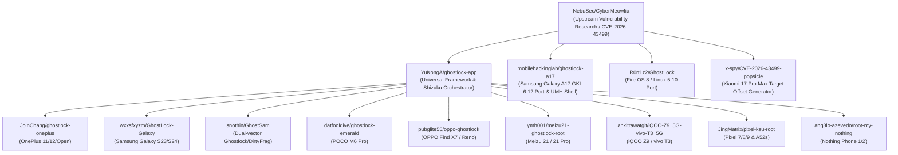
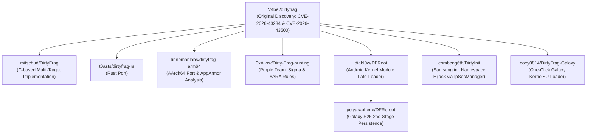

# Speed Lock — Duplicate, Fork, and Submodule Relationship Analysis

This document identifies code provenance, upstream-downstream lineages, identical repository names disambiguated for Windows filesystem compatibility, and nested submodule dependencies across the 32 archived repositories.

---

## 1. Filesystem Collision Disambiguation (NTFS Case Insensitivity)

On Windows NTFS filesystems, directory paths are case-preserving but case-insensitive. Two repositories in the curated list share the identical name `dirtyfrag` in differing letter cases:
- `mitschud/DirtyFrag` (C-based Linux/Android DirtyFrag implementation)
- `V4bel/dirtyfrag` (Original research reference PoC by Hyunwoo Kim)

### Conflict Analysis
If both were cloned into `repositories/dirtyfrag/DirtyFrag` and `repositories/dirtyfrag/dirtyfrag`, the second clone would detect the existing `.git` directory and either fail, corrupt the index, or overwrite the working tree.

### Applied Resolution
Distinct directory naming was applied to maintain both independent Git histories without collisions:
- `repositories/dirtyfrag/DirtyFrag-mitschud` -> Remote: `https://github.com/mitschud/DirtyFrag`
- `repositories/dirtyfrag/dirtyfrag-V4bel` -> Remote: `https://github.com/V4bel/dirtyfrag`

Both repositories preserve their intact Git remotes, full commit histories, branches, tags, and origin references.

---

## 2. Companion Tool & Payload Pairs

Several projects in the archive separate high-level orchestration (APKs, Python CLI, scripts) from native exploit payloads (ELF binaries, precompiled modules, offset tables):

| Toolkit Repository | Companion Payload Repository | Relationship & Architecture |
|---|---|---|
| `BuSung-dev/Root-My-Galaxy` | `BuSung-dev/Root-My-Galaxy-Payloads` | `Root-My-Galaxy` pulls compiled device payloads dynamically from the Payloads repository. The Payloads repository houses device-specific kernel modules, SELinux policies, and precompiled binaries. |
| `alex193a/Root-My-Pixel` | `alex193a/Root-My-Pixel-Payloads` | `Root-My-Pixel` includes `Root-My-Pixel-Payloads` as a Git submodule at the path `Root-My-Pixel-Payloads`. The Payloads repository is also cloned independently at `repositories/device-specific-projects/Root-My-Pixel-Payloads` for standalone static inspection. |
| `tqmane/Root-My-Device` | `WitAqua-tools/Root-My-Device-Payloads` | `Root-My-Device` is the primary multi-OEM orchestration project. `WitAqua-tools/Root-My-Device-Payloads` is an extended fork maintaining external hardware payloads (including Meta Quest 3 and new vendor modules). |

---

## 3. Submodule Mapping & Nested Git Trees

Three repositories embed submodules that were initialized and preserved during archival:

### 1. `repositories/device-specific-projects/Root-My-Device`
- **Submodule 1:** `src/kernelsu/KernelSU`  
  - Remote: `https://github.com/tiann/KernelSU.git`  
  - Purpose: Upstream KernelSU driver and userspace interface headers.
- **Submodule 2:** `src/kernelsu/Root-My-Device-KSU`  
  - Remote: `https://github.com/tqmane/Root-My-Device-KSU.git`  
  - Branch: `rmn-final-vector`  
  - Purpose: Patched KernelSU build incorporating runtime memory injection vectors.

### 2. `repositories/device-specific-projects/Root-My-Device-Payloads`
- **Submodule 1:** `src/kernelsu/KernelSU`  
  - Remote: `https://github.com/tiann/KernelSU.git`  
  - Purpose: Upstream KernelSU reference code.
- **Submodule 2:** `src/kernelsu/Root-My-Device-KSU`  
  - Remote: `https://github.com/Witaqua-tools/Root-My-Device-KSU.git`  
  - Purpose: WitAqua fork of the injection driver for additional targets.

### 3. `repositories/device-specific-projects/Root-My-Pixel`
- **Submodule 1:** `Root-My-Pixel-Payloads`  
  - Remote: `https://github.com/alex193a/Root-My-Pixel-Payloads.git`  
  - Purpose: Native payload binaries and offset definitions for Tensor-based Pixel generations.

---

## 4. Lineage and Fork Taxonomy

### A. GhostLock / IonStack Research Lineage

### B. DirtyFrag Research Lineage

---

## 5. Summary of Upstream vs Downstream Modifications

1. **Vendor Adaptations:** Upstream PoCs (`CyberMeowfia`, `V4bel/dirtyfrag`) demonstrate fundamental primitives. Downstream repositories adapt these primitives to specific vendor kernel builds by extracting structure offsets (e.g., `task_struct`, `cred`, `mm_struct`, `selinux_state`) from vendor firmware boot images.
2. **SELinux & Namespace Traversals:** While upstream Linux PoCs focus on user-to-root escalations on standard distributions (Ubuntu, Fedora), Android-specific ports (`DirtyInit`, `ghostlock-a17`, `lspromise`) must navigate SELinux domain transitions (`u:r:untrusted_app:s0` -> `u:r:system_server:s0` -> `u:r:init:s0` -> `u:r:kernel:s0`).
3. **Detection Artifacts:** `Dirty-Frag-hunting` is unique in providing defensive counter-measures against the entire vulnerability family.
