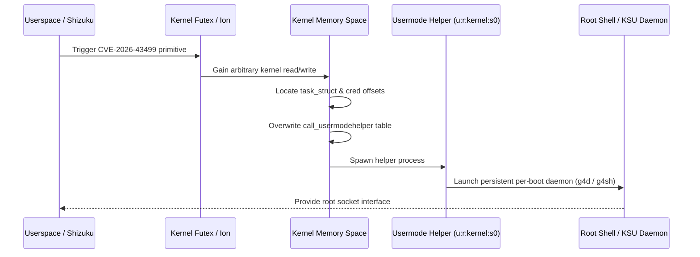

# Speed Lock — Exploit Chain Architectures & Primitives

This document provides in-depth technical analysis of the primary privilege escalation mechanisms catalogued in the Speed Lock archive.

---

## 1. IonStack / GhostLock Chain (CVE-2026-43499)

### Overview
CVE-2026-43499 ("GhostLock") is a kernel vulnerability originating in the Android Ion / memory allocation and futex subsystem. First analyzed by Nebula Security (`CyberMeowfia`), it provides a high-reliability kernel write primitive that can be leveraged on locked bootloaders.

### Exploitation Stages

1. **Primitive Acquisition:** The exploit leverages a futex waiter state confusion combined with Ion buffer mapping to gain an arbitrary physical memory write primitive.
2. **Kernel Symbol & Offset Resolution:** The target kernel offsets (`task_struct`, `cred`, `call_usermodehelper`) are either extracted dynamically or provided via predefined HOCON profiles (as implemented in `ghostlock-app`).
3. **Usermode Helper Hijack:** Rather than directly modifying credentials (which triggers Samsung RKP / Knox Defex violation checks), the exploit hijacks the kernel's usermode helper execution path.
4. **Execution in `u:r:kernel:s0`:** The spawned helper runs directly within the highest kernel domain (`context=u:r:kernel:s0`, `uid=0`, `gid=0`).
5. **Per-Boot Daemon:** A background daemon (e.g., `g4d` on Galaxy A17) is established, exposing a local socket relay for root commands without destabilizing the kernel.

---

## 2. DirtyFrag Page Cache Write (CVE-2026-43284 / CVE-2026-43500)

### Overview
Discovered by Hyunwoo Kim (@v4bel), DirtyFrag represents an evolution of the Linux page-cache write vulnerability class (following Dirty Pipe / CVE-2022-0847 and Copy Fail / CVE-2023-3776).

### Mechanics
1. **Target Subsystems:**
   - `CVE-2026-43284`: xfrm-ESP IPsec packet processing.
   - `CVE-2026-43500`: RxRPC network transport protocol.
2. **Deterministic Nature:** Unlike race-condition vulnerabilities, DirtyFrag is a deterministic logic flaw in page cache reference handling. The exploit does not require heap spraying, timing loops, or race windows.
3. **Zero Kernel Panic:** If an offset is miscalculated or an environment is patched, the operation safely returns an error code rather than triggering a kernel panic (oops).
4. **Arbitrary File Overwrite:** Allows an unprivileged user to overwrite pages in the page cache of any readable file (including read-only system files such as `/system/lib64/libbase.so` or loaded kernel modules).

---

## 3. DirtyInit: Init Namespace Hijacking

### Overview
Developed by `combeng6th`, `DirtyInit` provides one-touch root on Samsung devices by targeting the Android `init` namespace (`u:r:init:s0`).

### Execution Flow
1. **Unprivileged Socket Allocation via `IpSecManager`:** Rather than requiring `CAP_SYS_ADMIN` or a Phase-1 escalation to allocate xfrm sockets, DirtyInit utilizes the public Android Java `IpSecManager` API. `system_server` processes these API requests within its own privileged namespace and proxies the socket creation to `netd`.
2. **Targeting `libbase.so`:** DirtyFrag overwrites the `LogMessage` function in `/system/lib64/libbase.so`.
3. **Init Forking:** Because `init` constantly calls `LogMessage` for system logging, it immediately executes the injected payload.
4. **Unix Stream Socket Relay:** The payload causes `init` to fork a child and bind a Unix stream socket.
5. **SELinux Restriction Navigation:** `init` possesses zero `execute_no_trans` SELinux permissions, meaning it cannot execute arbitrary third-party binaries without dropping into a restricted domain. DirtyInit avoids this by running commands directly through the socket stream within the init context.

---

## 4. LSPromise: Zero-Memory-Corruption Escalation

### Overview
Authored by the `LSPosed` team, `lspromise` achieves privilege escalation on Google Pixel 10 running Android 17 without relying on memory corruption.

### Vulnerability Pair
1. **Userspace Flaw:** A logic flaw in `InCallController.java` within the Android Telecom service allows an unprivileged application to register an intent service and execute code within `system_server`.
2. **Kernel Flaw:** A kernel 1-day primitive accessible from `system_server` allows late-loading KernelSU drivers.
3. **Mitigation Immunity:** Because no memory corruption or heap manipulation occurs, modern hardware and software mitigations (MTE, CFI, KASLR, SafeStack) are completely bypassed with 100% reliability.
