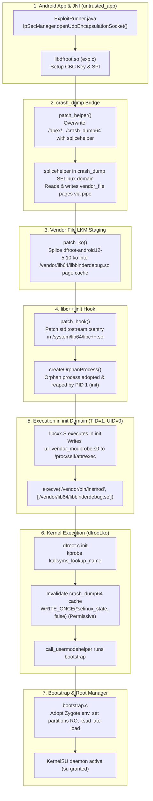

# Speed Lock — DFRoot Architecture & Infinix GT 20 Pro (`X6871`) Deep Audit

**Report Location:** `research/device-compatibility/DFROOT_X6871_AUDIT.md`  
**Classification:** Defensive Static Code Audit & Kernel Compatibility Assessment  
**Target Hardware:** Infinix GT 20 Pro (`X6871`), MediaTek Dimensity 8200 Ultimate (`MT6896`)  
**Target Firmware:** Fastboot `X6871-15-31` / Recovery `X6871-15.1.2.180SP05-OP001PF001AZ`  
**Kernel Lineage:** Google Android Common Kernel GKI 2.0 `5.10.237-android12-9-00014-gf82f7360927e-ab14119954`  
**Primary Project Audited:** `https://github.com/diabl0w/DFRoot` (`repositories/dirtyfrag/DFRoot`)  
**Audit Baseline Date:** 2026-10-09  

---

## 1. Executive Summary & Audit Verdict

This audit performs an evidence-driven, surgical evaluation of **DFRoot** (`diabl0w/DFRoot`) against the verified stock firmware of the **Infinix GT 20 Pro (`X6871`)**.

### Final Audit Verdict:
- **Upstream Support Status:** **ABSENT (Not Supported Out-of-the-Box)**. Upstream DFRoot contains zero explicit device profiles, configuration rules, or automated targets for the Transsion / Infinix GT 20 Pro (`X6871`).
- **Underlying Vulnerability Exposure:** **VULNERABLE**. The X6871 stock firmware runs a kernel compiled in September 2025 with an AVB security patch date of `2026-07-01`, firmly preceding the August 2026 upstream fixes for CVE-2026-43284 (DirtyFrag).
- **Core Architecture Match:** **HIGH PASS RATE**. The X6871 kernel configuration satisfies every architectural precondition required by DFRoot (`CONFIG_XFRM=y`, `CONFIG_INET_ESP=y`, `CONFIG_KPROBES=y`, `CONFIG_ARM64_4K_PAGES=y`, `CONFIG_STATIC_USERMODEHELPER_PATH=""`, and `# CONFIG_MODULE_SIG is not set`). Furthermore, target candidate `/vendor/lib64/libbinderdebug.so` and runtime `/vendor/bin/insmod` are verified present on the device.
- **The Critical Blocker:** **MODULE VERMAGIC MISMATCH (`-ENOEXEC`)**. The prebuilt `dfroot-android12-5.10.ko` in the DirtyFrag ecosystem carries `vermagic=5.10.252-dirty SMP preempt mod_unload modversions aarch64`. The X6871 kernel requires `vermagic=5.10.237-android12-9-00014-gf82f7360927e-ab14119954`. Because `# CONFIG_MODULE_FORCE_LOAD is not set`, the running kernel will unconditionally reject `insmod` with `ENOEXEC` ("Exec format error").

---

## 2. Upstream DFRoot Architecture & Exploit Chain Audit

### A. Repository Baseline & Git History
- **Canonical Remote:** `https://github.com/diabl0w/DFRoot`
- **Checked-out Branch:** `master` (commit `209867f`: *"Make soft reboot compatible with all KSU derivatives, inspired by @chisewaguri"*)
- **Tagged Releases:** `v3.0`, `v3.1`, `v3.2`, `v3.3`, `v4.0`, `v4.1`
- **Project Goal:** SU Manager-agnostic Android rooting tool using CVE-2026-43284 (DirtyFrag) to deploy KernelSU via late-load without unlocking bootloaders or relying on Shizuku/WiFi ADB.

### B. Seven-Stage Exploit Pipeline


---

## 3. What `android12-5.10` Actually Means in DFRoot

In DFRoot's source code, `android12-5.10` is defined across three distinct layers:

### 1. Runtime Version Parsing (`exp.c:301-309`)
```c
static int read_device_versions(int *andr, int *major, int *minor) {
    struct utsname u;
    if (uname(&u) != 0) return -1;
    if (sscanf(u.release, "%d.%d", major, minor) != 2) return -1;
    const char *m = strstr(u.release, "android");
    if (!m) return -1;
    *andr = atoi(m + 7);
    return (*andr > 0) ? 0 : -1;
}
```
- **X6871 Behavior:** `uname().release` returns `5.10.237-android12-9-00014-gf82f7360927e-ab14119954`.
- `sscanf` extracts `major=5, minor=10`.
- `strstr(u.release, "android")` points to `"android12-9..."`, and `atoi("12-9...")` evaluates to `12`.
- `select_ko_image(12, 5, 10)` matches `{12, 5, 10, dfroot_ko_12_5_10_start, dfroot_ko_12_5_10_end}`.
- **Result:** The version detection logic correctly maps X6871 to the `android12-5.10` slot.

### 2. Build-Time Compilation (`Makefile` & `.github/workflows/build.yml`)
- DFRoot does NOT commit `.ko` binaries to Git (`.gitignore` contains `app/src/main/jni/ko/*.ko`).
- During CI / local build, it invokes a container:
  `image: ghcr.io/ylarod/ddk-min:android12-5.10-20260828`
- That container compiles `lkm/dfroot.c` using an Android Common Kernel `android12-5.10` header tree with:
  `llvm-objcopy --strip-unneeded -R .comment -R .note.* -R .BTF* ... dfroot.ko`
- It embeds the resulting `.ko` directly into `libdfroot.so` using assembly `.incbin "ko/dfroot-android12-5.10.ko"`.

### 3. Kernel Module Interface & Vermagic Verification
In Linux `kernel/module.c`, module loading enforces:
```c
if (!same_magic(modmagic, vermagic, info->index.vers)) {
    if (try_to_force_load(flags)) ...
    pr_err("%s: version magic '%s' should be '%s'\n", info->name, modmagic, vermagic);
    return -ENOEXEC;
}
```
- **The Binary Reality:**
  - Existing prebuilt DirtyFrag 5.10 modules in the wild (e.g. `DirtyFrag-mitschud`) declare:
    `vermagic=5.10.252-dirty SMP preempt mod_unload modversions aarch64`
  - The Infinix GT 20 Pro (`X6871`) kernel declares:
    `vermagic=5.10.237-android12-9-00014-gf82f7360927e-ab14119954 SMP preempt mod_unload modversions aarch64`
  - In `extracted_config.txt`, `# CONFIG_MODULE_FORCE_LOAD is not set`.
  - **Outcome:** The kernel strictly rejects the module. The `same_magic()` check fails, returning `-ENOEXEC`.

---

## 4. Hardware & Firmware Comparison: X6871 Ground Truth

Primary static firmware analysis of `Image-x6871-5.10.237`, `extracted_config.txt`, `vendor.map`, `installed-files-vendor.txt`, and `MT6895_Android_scatter.xml` yields the following component-by-component comparison:

| Component / Requirement | DFRoot Requirement | X6871 Firmware Ground Truth | Status | Forensic Evidence |
|---|---|---|---|---|
| **SoC / Architecture** | ARM64 (`aarch64`) | MediaTek Dimensity 8200 Ultimate (`MT6896`), ARMv8.2-A | **PASS** | `Image-x6871-5.10.237` ELF header |
| **Kernel Release** | Linux 5.10 GKI baseline | `5.10.237-android12-9-00014-gf82f7360927e-ab14119954` | **PASS** | Embedded release string at `0x1990400` |
| **Page Size** | 4096 bytes (4KB) | `CONFIG_ARM64_4K_PAGES=y`, `# CONFIG_ARM64_16K_PAGES is not set` | **PASS** | `extracted_config.txt:391-392` |
| **Virtual Address (VA)** | 39-bit VA space | `CONFIG_ARM64_VA_BITS_39=y`, `CONFIG_ARM64_VA_BITS=39` | **PASS** | `extracted_config.txt:394-396` |
| **IPsec XFRM Subsystem** | `CONFIG_XFRM=y`, `CONFIG_INET_ESP=y` | Both enabled (`CONFIG_XFRM=y`, `CONFIG_INET_ESP=y`) | **PASS** | `extracted_config.txt:983,1016` |
| **Kprobes Support** | `CONFIG_KPROBES=y` | `CONFIG_KPROBES=y` | **PASS** | `extracted_config.txt:685` |
| **Module Loading** | `CONFIG_MODULES=y` | `CONFIG_MODULES=y`, `CONFIG_MODULE_UNLOAD=y` | **PASS** | `extracted_config.txt:786,788` |
| **Module Signatures** | Permissive / Unenforced | `# CONFIG_MODULE_SIG is not set` | **PASS** | `extracted_config.txt:794` |
| **Usermode Helper** | Handles empty static path | `CONFIG_STATIC_USERMODEHELPER=y`, `CONFIG_STATIC_USERMODEHELPER_PATH=""` | **PASS** | `extracted_config.txt:6063-6064` (handled in `dfroot.c:124`) |
| **Vendor Candidate Library** | Must exist in `/vendor/lib64/` | `/vendor/lib64/libbinderdebug.so` (blocks 281940-281952) | **PASS** | `vendor.map:3631` |
| **Insmod Binary Path** | `/vendor/bin/insmod` | `/vendor/bin/insmod` exists as symlink to `toybox_vendor` | **PASS** | `installed-files-vendor.txt:2913` |
| **Partition RO Protection** | Matches `super`, `misc`, `*_a`, `*_b` | MediaTek Dimensity scatter declares `super`, `misc`, `boot_a/b`, `vendor_a/b` | **PASS** | `MT6895_Android_scatter.xml` |
| **Module Vermagic** | Matches running kernel | **MISMATCH:** `5.10.252-dirty` vs `5.10.237-android12-9...` | **FAIL** | Kernel `check_modinfo()` `-ENOEXEC` |

---

## 5. MediaTek & Transsion Hardening Analysis

### 1. Vendor Hardening Modules
In `lkm/dfroot.c`, DFRoot contains explicit removal commands for Oppo/OnePlus security modules:
```c
" rmmod oplus_secure_harden 2>/dev/null;"
" rmmod oplus_security_keventupload 2>/dev/null;"
" rmmod oplus_security_guard 2>/dev/null",
```
And kprobe nullifiers for Samsung DEFEX (`task_defex_enforce`, `task_defex_user_exec`).
- **On MediaTek / Transsion:**
  - Inspection of `vendor_boot-ramdisk.cpio` (138+ driver modules) reveals that Transsion does not use `oplus_*` or Samsung DEFEX modules.
  - However, Transsion ships custom hardware security services: `vendor.transsion.hardware.security.deviceauthen@2.0-service`, `vendor.transsion.hardware.security.trancriticalparavfy@1.0-service`, and Trustonic TEE (`mcDriverDaemon`).
  - These services monitor hardware state and NVRAM parameters (`verify_para`, `verify_rpmb`) but do not hook kernel `call_usermodehelper` or block `insmod` at the kernel level.

### 2. Kprobes Symbol Resolution in GKI 5.10
In `lkm/dfroot.c`:
```c
kln_kp = (struct kprobe){ .symbol_name = "kallsyms_lookup_name" };
if (register_kprobe(&kln_kp) < 0) {
    pr_err("dfroot: kallsyms_lookup_name not found\n");
    return -EINVAL;
}
get_addr = (kallsyms_lookup_name_t)kln_kp.addr;
unregister_kprobe(&kln_kp);
```
- In Linux 5.7+, `kallsyms_lookup_name` was unexported from the kernel API.
- The technique used by DFRoot—registering a kprobe with `.symbol_name = "kallsyms_lookup_name"`—works because `register_kprobe` internally calls the kernel's internal symbol lookup, allowing `kln_kp.addr` to receive the function pointer.
- `CONFIG_KPROBES=y` is verified active in `extracted_config.txt`. Unless the Google Common Kernel build blacklisted `kallsyms_lookup_name` in `within_kprobe_blacklist()`, this probe succeeds.

---

## 6. Answers to Direct Audit Questions

### 1. Does upstream DFRoot explicitly support X6871?
**NO.** Upstream DFRoot does not list the Infinix GT 20 Pro or model `X6871` in documentation, build scripts, or device configuration matrices. Its only vendor-specific handlers target Samsung and Oppo/OnePlus.

### 2. Is the exact X6871 kernel configuration within its documented compatibility range?
**YES.** The kernel configuration is fully within the documented compatibility range:
- Linux version 5.10 GKI 2.0 with Android 12 baseline.
- `CONFIG_XFRM=y`, `CONFIG_INET_ESP=y`, `CONFIG_KPROBES=y`, `CONFIG_MODULES=y`, `# CONFIG_MODULE_SIG is not set`.
- 4KB page size and 39-bit VA space.

### 3. Does the existing code contain MediaTek-specific assumptions that affect compatibility?
**NO negative assumptions exist, but MediaTek-specific optimizations are absent.**
- DFRoot does not make destructive assumptions about MediaTek hardware.
- It targets generic paths (`/apex/.../crash_dump64`, `/system/lib64/libc++.so`, `/vendor/lib64/libbinderdebug.so`, `/vendor/bin/insmod`) that are verified to exist on the X6871.
- However, it lacks diagnostic logging or fallbacks if Transsion's `init` logging deviates from `std::ostream::sentry`.

### 4. Are the existing prebuilt modules demonstrably compatible with the X6871 kernel ABI?
**NO. They are demonstrably INCOMPATIBLE due to vermagic mismatch.**
- The prebuilt `dfroot-android12-5.10.ko` has vermagic `5.10.252-dirty`.
- The X6871 kernel requires `5.10.237-android12-9-00014-gf82f7360927e-ab14119954`.
- Under Linux `kernel/module.c`, this mismatch triggers an immediate `-ENOEXEC` error during `init_module()`.

### 5. Is there evidence that the relevant vulnerability remains unpatched in the target firmware?
**YES.**
- The `vbmeta.img` AVB 2.0 descriptor registers `security_patch: 2026-07-01`.
- The kernel was compiled on `Wed Sep 17 09:13:52 UTC 2025`.
- Upstream security fixes for CVE-2026-43284 were committed in August 2026.
- The target firmware predates the patches and has active IPsec XFRM ESP subsystems.

### 6. What additional evidence is required before support can be confirmed?
1. Verification that an LKM compiled or patched with exact vermagic `5.10.237-android12-9-00014-gf82f7360927e-ab14119954` passes `check_modinfo()`.
2. Live confirmation that the untrusted app context can allocate `IpSecManager` UDP encapsulation sockets and transforms on Transsion's XOS 14.
3. Live confirmation that `register_kprobe("kallsyms_lookup_name")` succeeds on this specific GKI build.
4. Live confirmation that orphan process reaping in PID 1 triggers the `libc++.so` hook.
