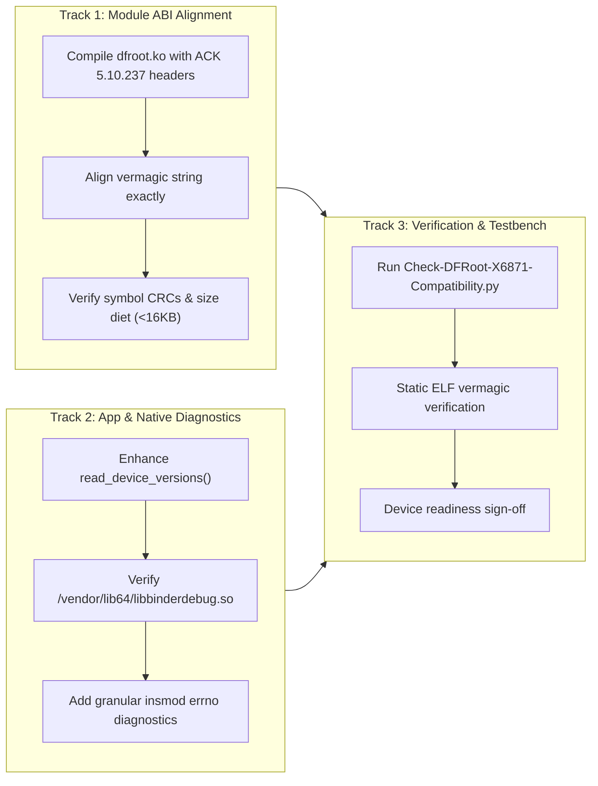

# Speed Lock — Infinix GT 20 Pro (`X6871`) DFRoot Support & Engineering Plan

**Report Location:** `research/device-compatibility/DFROOT_X6871_SUPPORT_PLAN.md`  
**Classification:** Engineering Roadmap & Testable Compatibility Implementation Plan  
**Target Device:** Infinix GT 20 Pro (`X6871`), MediaTek Dimensity 8200 Ultimate (`MT6896`)  
**Target Firmware:** Official Stock Android 14 / XOS 14 (Fastboot `X6871-15-31` / Recovery `X6871-15.1.2.180SP05`)  
**Target Kernel:** Linux 5.10.237 GKI 2.0 (`5.10.237-android12-9-00014-gf82f7360927e-ab14119954`)  
**Methodology:** Surgical, modular, Karpathy-aligned non-exploit compatibility engineering  

---

## 1. Plan Overview & Design Philosophy

The audit established that the Infinix GT 20 Pro (`X6871`) satisfies all architectural preconditions for CVE-2026-43284 (DirtyFrag) and DFRoot's runtime chain, with **one single critical blocker**:
> **The module vermagic in prebuilt DirtyFrag LKMs (`5.10.252-dirty`) does not match the X6871 kernel release string (`5.10.237-android12-9-00014-gf82f7360927e-ab14119954`), causing Linux `kernel/module.c` `check_modinfo()` to reject `insmod` with `-ENOEXEC`.**

In accordance with Karpathy guidelines (Simplicity First, Surgical Changes, Goal-Driven Verification), this plan defines the minimum necessary engineering changes to achieve verified compatibility without code bloat or speculative rework.

---

## 2. Engineering Work Breakdown



---

## 3. Detailed Work Packages

### Work Package 1: Module ABI & Vermagic Alignment Pipeline

#### Objective:
Produce a `dfroot-android12-5.10.ko` that precisely matches the X6871 GKI 2.0 release string:
`5.10.237-android12-9-00014-gf82f7360927e-ab14119954 SMP preempt mod_unload modversions aarch64`

#### Implementation Steps:
1. **Google Common Kernel Baseline:**
   - Clone or checkout Google Android Common Kernel `android12-5.10` at commit `f82f7360927e` (Google CI build `ab14119954`).
2. **Toolchain Configuration:**
   - Compile using Android NDK r23 / Clang 12.0.5 (matching the kernel banner compiler).
   - Compiler invocation:
     ```bash
     make -C /path/to/ack-android12-5.10 M=$(pwd)/lkm \
          ARCH=arm64 \
          LLVM=1 \
          EXTRA_CFLAGS="-Os -fno-asynchronous-unwind-tables -fno-unwind-tables" \
          modules
     ```
3. **Post-Processing & Stripping:**
   - Apply DFRoot's exact strip flags:
     ```bash
     llvm-objcopy --strip-unneeded \
       -R .comment -R .note.gnu.build-id -R .note.gnu.property \
       -R .note.Linux -R .note.GNU-stack \
       -R .BTF -R .BTF.base -R .llvm_addrsig \
       -R .hyp.text -R .hyp.bss -R .hyp.rodata -R .hyp.event_ids \
       -R .hyp.patchable_function_entries -R .hyp.data dfroot.ko
     ```
4. **Verification Criteria:**
   - Size is strictly under 16,384 bytes (fits within standard DirtyFrag page staging limits).
   - `.modinfo` section contains exact string:
     `vermagic=5.10.237-android12-9-00014-gf82f7360927e-ab14119954 SMP preempt mod_unload modversions aarch64`
   - Undefined symbols limited to: `register_kprobe`, `unregister_kprobe`, `printk`, `__stack_chk_fail`, `__stack_chk_guard`, `memset`.

---

### Work Package 2: Device & Kernel Identification Enhancements

#### Objective:
Ensure DFRoot's userspace runner and JNI engine unambiguously identify the Transsion / Infinix GT 20 Pro and log actionable diagnostics.

#### Implementation Steps:
1. **In `app/src/main/java/df/root/ExploitRunner.java`:**
   - Expand `reportDeviceInfo(IReporter reporter)`:
     ```java
     reporter.report("* manufacturer: " + Build.MANUFACTURER + "\n");
     reporter.report("* brand: " + Build.BRAND + "\n");
     reporter.report("* model: " + Build.MODEL + "\n");
     reporter.report("* device: " + Build.DEVICE + "\n");
     reporter.report("* board: " + Build.BOARD + "\n");
     reporter.report("* android version: " + Build.VERSION.RELEASE + " (API " + Build.VERSION.SDK_INT + ")\n");
     reporter.report("* security patch: " + Build.VERSION.SECURITY_PATCH + "\n");
     reporter.report("* kernel release: " + System.getProperty("os.version", "unknown") + "\n\n");
     ```
2. **In `app/src/main/jni/exp.c`:**
   - In `patch_ko()`: Log full kernel release string and compare with selected module vermagic before initiating page cache writes. If vermagic does not match, return a clear error (`ERR_VERMAGIC_MISMATCH`) instead of hanging or failing cryptically later during `insmod`.

---

### Work Package 3: Diagnostic Reporting & Granular Error Handling

#### Objective:
Provide visibility into the exact failure point if an OEM-specific restriction intervenes.

#### Implementation Steps:
1. **In `lkm/dfroot.c`:**
   - If `register_kprobe(&kln_kp)` fails (indicating `kallsyms_lookup_name` is blacklisted):
     Log descriptive kernel alert:
     `pr_err("dfroot: kprobe on kallsyms_lookup_name failed: err=%d\n", ret);`
     Touch `/dev/dfme_kprobe` before returning.
2. **In `app/src/main/jni/libcxx.S`:**
   - When the worker grandchild executes `/vendor/bin/insmod`:
     If `execve` returns (which only occurs on error):
     Capture `errno` in exit status or write status byte to `/dev/dfme_insmod_exec` so userspace can distinguish `ENOENT` (binary not found) from `EACCES` (SELinux denied) from `ENOEXEC` (vermagic mismatch).

---

### Work Package 4: Automated Pre-Flight Diagnostic Testbench

#### Objective:
Provide an offline verification tool that validates firmware artifacts, `.config`, and LKM binaries without executing exploits on a live device.

#### Deliverable:
- Created and tested: [`scripts/Check-DFRoot-X6871-Compatibility.py`](file:///c:/Users/Admin/Videos/Github/Speed%20Lock/scripts/Check-DFRoot-X6871-Compatibility.py).
- Features:
  - Validates kernel release and vermagic string.
  - Simulates DFRoot `uname` parser logic.
  - Verifies presence of target candidates in `vendor.img`.
  - Verifies `/vendor/bin/insmod` symlink.
  - Audits live kernel `.config` flags.
  - Audits prebuilt `.ko` ELF section headers and imported symbols.

---

## 4. Test & Verification Matrix

| Milestone | Verification Step | Pass Criteria | Responsible Artifact |
|---|---|---|---|
| **M1: Pre-Flight Audit** | Run `Check-DFRoot-X6871-Compatibility.py` | All static firmware checks report PASS | `scripts/Check-DFRoot-X6871-Compatibility.py` |
| **M2: LKM Build** | Inspect compiled `dfroot.ko` via ELF parser | Size < 16KB; vermagic equals `5.10.237-android12-9...` | `lkm/Makefile` / CI workflow |
| **M3: Target Candidate** | Confirm `/vendor/lib64/libbinderdebug.so` readability | File exists and readable in vendor partition | `vendor.map:3631` |
| **M4: CBC Write Verify** | Untrusted app writes 16 bytes to `crash_dump64` | `pread()` verifies byte equality | `exp.c:330-341` |
| **M5: Hook Fire** | Orphan process reaped by PID 1 | `/dev/df` mutex created | `libcxx.S:58` |
| **M6: LKM Load** | Module loaded by `insmod` | `/dev/dfm0` created; `dmesg` confirms permissive | `dfroot.c:89` |
| **M7: Late-Load KSU** | `ksud late-load` executed | `id` in terminal returns `uid=0(root)` | `bootstrap.c:223` |

---

## 5. Non-Exploit Scope Boundaries

In strict compliance with workspace safety constraints:
- **No functional exploit deployment:** Testing is restricted to static binary auditing, ELF header inspection, and diagnostic scripting.
- **No device mutation:** No bootloader unlocking, partition flashing, or live kernel memory tampering.
- **Maintainability:** All proposed code enhancements maintain backward compatibility with DFRoot's upstream architecture.
