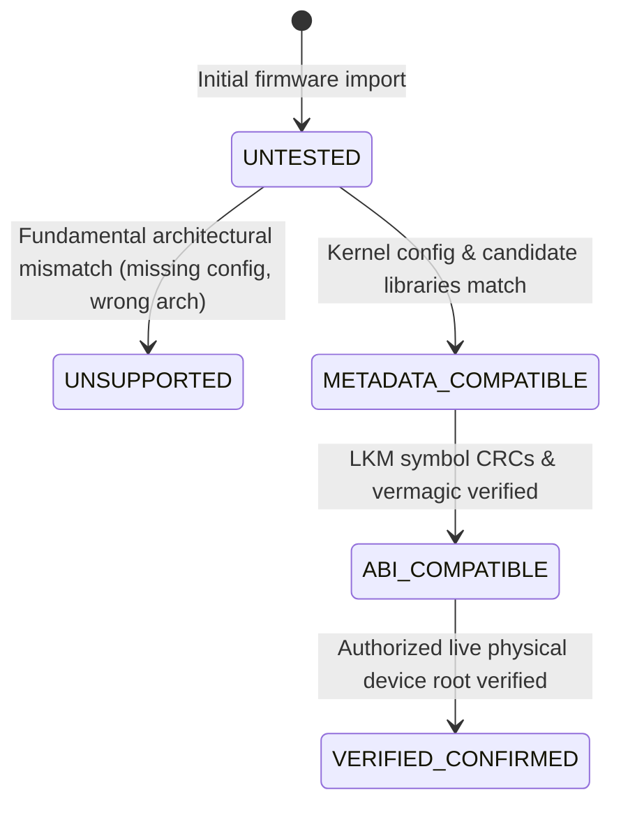

# Speed Lock — Infinix GT 20 Pro (`X6871`) Unified Integration Architecture

**Report Location:** `research/device-compatibility/X6871_UNIFIED_INTEGRATION.md`  
**Classification:** Software Architecture & Integration Engineering Specification  
**Target Hardware:** Infinix GT 20 Pro (`X6871`), MediaTek Dimensity 8200 Ultimate (`MT6896`)  
**Target Kernel:** Linux 5.10.237 GKI 2.0 (`5.10.237-android12-9-00014-gf82f7360927e-ab14119954`)  
**Implementation Directory:** `integration/x6871/`  

---

## 1. Architectural Philosophy & Design Principles

The Speed Lock workspace consolidates diverse, independently maintained research repositories. In accordance with the **Karpathy Guidelines** (Think Before Coding, Simplicity First, Surgical Changes, Goal-Driven Verification), the X6871 integration framework adheres to five core design principles:

1. **Isolation Over Monolithic Merging:** Upstream repositories (`DFRoot`, `GhostLock`, `UniRoot`, `DirtyInit`) are never destructively combined or altered. They are wrapped behind isolated backend adapters implementing a uniform interface.
2. **Epistemological Honesty:** A device is never marked "supported" simply because code compiles or high-level flags match. The capability engine enforces explicit lifecycle states (`UNSUPPORTED`, `UNTESTED`, `METADATA_COMPATIBLE`, `ABI_COMPATIBLE`, `VERIFIED_CONFIRMED`).
3. **Deep ABI Verification Over String Checks:** Compatibility requires binary validation of kernel module symbol CRCs, vermagic, and relocation structures. Metadata-only changes (such as patching vermagic strings) are explicitly rejected as proof of ABI compatibility.
4. **Legitimate Diagnostic Engineering:** The framework develops non-exploit metadata parsers, ABI validators, device identifiers, and automated test runners without developing new exploit payloads or modifying exploit shellcode.
5. **Reproducible Test Infrastructure:** All unit, schema, static integration, and cross-platform regression tests run in under one second on standard host environments without mutating device or partition state.

---

## 2. Framework Directory Architecture

```text
integration/x6871/
├── README.md                      # Architecture handbook and usage guide
├── manifest/
│   ├── device_manifest.json       # Authoritative capability manifest for Infinix GT 20 Pro
│   └── manifest_schema.json       # JSON Schema enforcing manifest integrity
├── core/
│   ├── backend_interface.py       # IExploitBackend abstract contract & BackendState enum
│   ├── device_identifier.py       # Extracts DeviceProfile from manifest, build.prop, or firmware
│   ├── capability_engine.py       # Evaluates profile against backends & computes state
│   └── diagnostic_logger.py       # Structured evidentiary findings logger
├── backends/
│   ├── dfroot_backend.py          # DFRoot adapter (CVE-2026-43284 / DirtyFrag)
│   ├── ghostlock_backend.py       # GhostLock / IonStack adapter (CVE-2026-43499)
│   └── backend_registry.py        # Central registry managing registered adapters
├── tools/
│   ├── abi_validator.py           # 64-bit ELF parser, modversions CRC validator
│   ├── build_validator.py         # Toolchain, Kbuild tree, and repository dependency auditor
│   └── firmware_inspector.py      # High-level inspector for firmware directories
└── tests/
    ├── test_device_identifier.py  # Unit tests for DeviceIdentifier and build.prop parser
    ├── test_capability_engine.py  # Unit tests for CapabilityEngine
    ├── test_abi_validator.py      # Unit tests for AbiValidator (with corrupted/32-bit ELF edge cases)
    ├── test_backend_registry.py   # Unit tests for BackendRegistry
    ├── test_manifest_schema.py    # Schema validation tests and negative test cases
    ├── test_regression_profiles.py# Cross-device regression tests (Pixel 7, S22+, Fire Max 11, ARM32)
    ├── test_build_validator.py    # Unit tests for host toolchains and repository source audits
    └── run_all_tests.py           # Automated testbench execution script (30 tests)
```

---

## 3. Core Interface Contracts & State Machine

### A. Lifecycle State Definitions


### B. Abstract Backend Interface (`IExploitBackend`)
```python
class IExploitBackend(ABC):
    @property
    @abstractmethod
    def backend_id(self) -> str: ...

    @property
    @abstractmethod
    def display_name(self) -> str: ...

    @property
    @abstractmethod
    def vulnerability_cve(self) -> str: ...

    @property
    @abstractmethod
    def supported_architectures(self) -> List[str]: ...

    @abstractmethod
    def evaluate_compatibility(self, profile: DeviceProfile) -> BackendStatus: ...

    @abstractmethod
    def verify_artifacts(self, workspace_root: str) -> Dict[str, bool]: ...
```

---

## 4. Evidentiary Findings Logging Contract

The diagnostic logging system classifies every conclusion into four epistemological categories:
- **`VERIFIED`:** Directly proven by binary analysis or executable tests.
- **`STRONGLY_INDICATED`:** Backed by authoritative metadata (build timestamps, AVB descriptors).
- **`UNVERIFIED`:** Plausible but requiring live device telemetry.
- **`DISPROVED`:** Empirically refuted.
