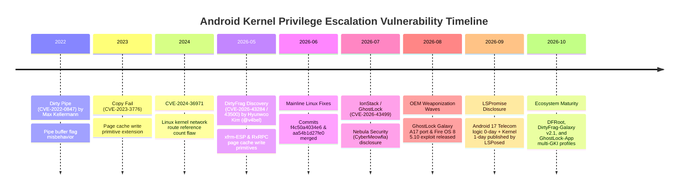

# Speed Lock — Upstream Vulnerability Discovery & Patching Timeline

This document tracks the discovery chronology, upstream Linux kernel patches, Android Security Bulletins, and credit attributions for the major vulnerabilities archived in Speed Lock.

---

## 1. Chronological Timeline

---

## 2. Kernel Upstream Commits & CVE Mapping

### A. DirtyFrag (CVE-2026-43284)
- **Subsystem:** `net/xfrm/xfrm_input.c` (xfrm-ESP)
- **Vulnerability Description:** Page cache write primitive allowing unprivileged local users to write arbitrary data to readable cached pages.
- **Mainline Fix Commit:** [`f4c50a4034e6`](https://git.kernel.org/pub/scm/linux/kernel/git/torvalds/linux.git/commit/?id=f4c50a4034e62ab75f1d5cdd191dd5f9c77fdff4)
- **Author / Credit:** Hyunwoo Kim (@v4bel)

### B. RxRPC Page-Cache Write (CVE-2026-43500)
- **Subsystem:** `net/rxrpc/` (RxRPC transport)
- **Vulnerability Description:** Deterministic page cache write flaw in the RxRPC protocol implementation.
- **Mainline Fix Commit:** [`aa54b1d27fe0`](https://git.kernel.org/pub/scm/linux/kernel/git/torvalds/linux.git/commit/?id=aa54b1d27fe0c2b78e664a34fd0fdf7cd1960d71)
- **Author / Credit:** Hyunwoo Kim (@v4bel)

### C. GhostLock / IonStack (CVE-2026-43499)
- **Subsystem:** Android Ion / Futex Memory Allocator
- **Vulnerability Description:** Kernel state inconsistency resulting in arbitrary kernel read/write and usermode helper execution.
- **Author / Credit:** Nebula Security (`CyberMeowfia`)
- **Downstream Ports:** MobileHackingLab (`ghostlock-a17`), R0rt1z2 (`GhostLock`), YuKongA (`ghostlock-app`)

### D. Android 17 Telecom Logic Flaw (LSPromise Chain)
- **Subsystem:** `packages/services/Telecomm/src/com/android/server/telecom/InCallController.java`
- **Vulnerability Description:** Unchecked `queryIntentServices` invocation allowing unprivileged applications to breach `system_server`.
- **AOSP Reference:** Commit `478761578b3ccb380410a4f5e82e1d0e388d59cf`
- **Author / Credit:** LSPosed Development Team
